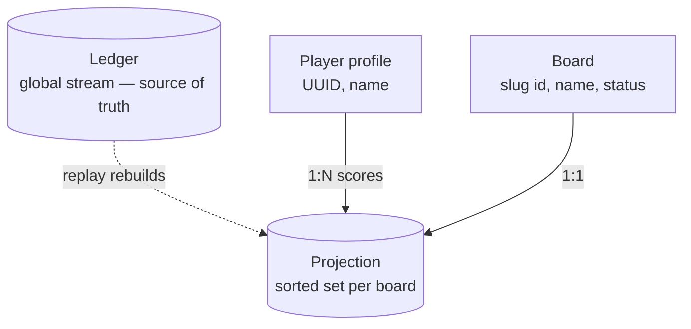
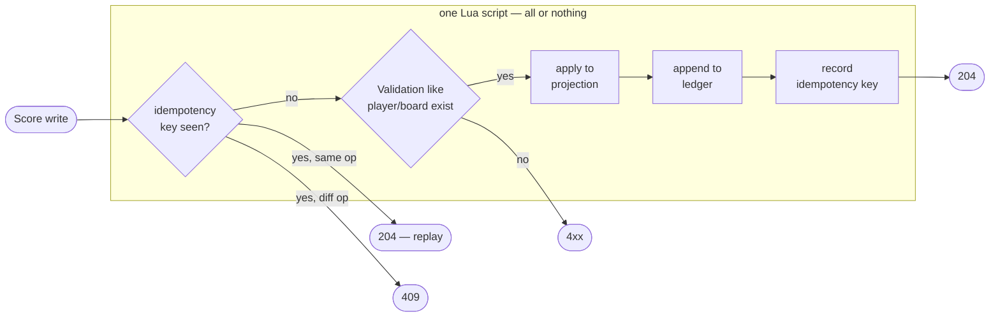

# Architecture

Apex is a leaderboard backend: a Go HTTP service with Redis as the only datastore.

## The core idea: event sourced score

Every score change is recorded as an **event** in an append-only **ledger** (a Redis Stream).
The ledger is the source of truth for the score values. The leaderboards are **projections**:
derived views that can be deleted and rebuilt from the ledger with an identical result.
Each leaderboard is a Redis Sorted Set.

Pros:

- a full audit history of every score (the history API is just a ledger read)
- disposable rankings - projection corruption is repaired by replay
- leaderboards projections (essentially secondary B-tree indexes) allow log times for range operations
- allows future views as new consumers of the same stream, with no
  changes to write operations. We can easily answer all sorts of questions, for example:
    - retrospective records: most active player in July 2025, my personal best of the summer '24
    - biggest single-day swing (biggest comeback)
    - milestones and races: who first crossed 1000 on a board
    - rivalry timeline: every moment A passed B
    - cheater detection: increments per minute per player

## Components

The ledger is the source of truth; every projection is derived from it and can be rebuilt by replay.

**Player profiles.** Global, board-independent documents (name, creation date) keyed by a
server-generated UUID. Creating a player is profile-only: a player can exist with no scores.

**Boards.** Named score containers. Ids are short, client-chosen slugs (`summer-contest2026`)
rather than UUIDs. They are readable and appear in URLs.
The board id is **immutable forever** (ids are written into ledger events),
however, a board has a mutable display name.
A registry (currently acts as a sorting index) keeps the list of boards in creation order.
The default board `main` is created at startup.

Boards has a status, currntly `active`/`closed`: a closed
board rejects score writes with `409` while reads and ledger replay are unaffected.
In particualr, a closed board allows to rebuild the leaderboard projection from the ledger without racing with
concurrent new score writes.
Board can be reopened.

Currently boards cannot be deleted.

**The ledger.** One global stream containing all score events.
Event is recorded only if the operation was succesfully applied (fact only).
Currently two event types exist: `set` and `increment` (a delta).
"Set" typed event acts as a snapshot barrier - replay never needs to look past the latest `set`.

Clients can consume the same global order through `GET /api/v1/events`: pass the last seen
event id an exclusive `after` cursor. It does not keep a
server-side subscription or cursor.

**Projections.** The actual leaderboards which face clients. One sorted set per board holding the current scores.
In app (not API) we call a projection entry a **standing**, because besides the score value it holds a player id
and also implicitly implies a "rank" - its index (1-based). So standing is a (score, player_id, rank). All standing reads -
top-N pages, a single player's standing - are cheap sorted-set operations. It allows listing operations use plain
limit/offset pagination.

**Idempotency hash.** Every write records a server-generated request id in its event.
A client might send an optional `Idempotency-Key` header: the write would store
a fingerprint (`entry_id|op|amount`) under that key with a TTL. This makes retries idempotent
(essential for the incrementing a score op).
The same key reused with a different op/amount is rejected with `409`. Score writes return
`204` (no body).

Player creation has its own idempotency (separate hash). A repeated replays posts nothing and returns
the same generated `player_id` or `409`s.

Board creation doesnt use this mechanics: `PUT` with a client-chosen slug is already retry-safe.

## The write operations

Steps in order: idempotency check → player/board exist & board active → apply to
projection → append event → record idempotency key (if supplied).

All steps run inside a single Lua script: projection and ledger move together or not at all.

Every score write runs one Lua script executing atomically: optional idempotency check → player and
board existence check → apply to the projection → append the event → record the idempotency key
(only when the client supplied one). Projection and ledger move together or not at all.

Rebuild and verification are the operational counterpart. Both are scoped to one board.
Rebuild folds board's ledger events into its projection (a leaderboard). Verification does the same but with a
scratch and then compares it with a live projection.

## How it got here

The design went through three stages:

1. **Hash + sorted set.** Player profiles are in hashes, scores in a sorted set. Player to score 1 to 1.
    One leaderboard. Inspired by (https://redis.io/solutions/leaderboards/).
2. **Event sourced scores.** The ledger became the source of truth and the sorted set a projection;
   scores gained history and idempotent writes.
3. **Multi-board.** Board became a first-class object. Board to a leaderboard projection 1 to 1.
   Player to scores 1 to N.

## TLDR

### Language

| Term              | Means                                                          | Context                   |
| ----------------- | -------------------------------------------------------------- | ------------------------- |
| **event**         | one applied operation (a fact)                                 | all                       |
| **ledger**        | append-only record of score **events**                         | all                       |
| **tombstone**     | the delete **event**                                           | app, API uses "delete"?   |
| **board**         | named score container with lifecycle.                          | all                       |
| projection        | content of the **board** (derived view of the **ledger**)      | app                       |
| standing          | **projection** read model: (playerId, boardId, value, rank)    | API uses generic "score"? |
| **replay**        | Build a **projection** using the **ledger**                    | app                       |
| idempotency table | idempotency records: what reqIds were applied using **events** | app                       |
| **profile**       | player's info (no score)                                       | all                       |
| **stream entry**  | Redis Stream item (raw **event**)                              | redis                     |

Contexts:

- all (codebase, docs, public API)
- app (codebase, docs)
- redis (storage codebase, not domain)

### Rules (invariants)

1. **The event stream is the source of truth for standings.** The leaderboard ZSET (Sorted Set) is a projection:
   it can be deleted and rebuilt from stream, and the result must be the same.

2. **Events record facts only.** An event exists iff the operation was applied.
   E.g failed score increment is not appended.

3. **A non idempotent write carries a client `request_id` (Idempotency-key).**
   Retrying the same request_id produces the same result.

4. **`set` is a snapshot barrier.** The current score of a player is:
   `last set value + sum of increments after it`. Replay never needs to look
   past the most recent `set`.
