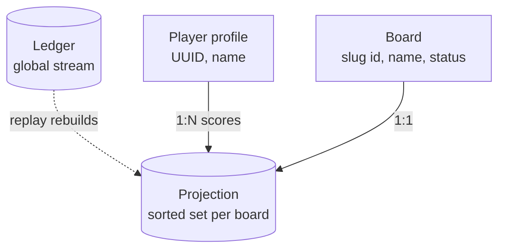
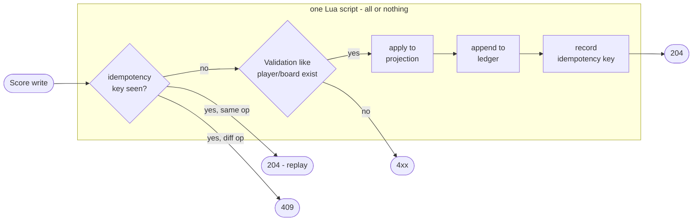
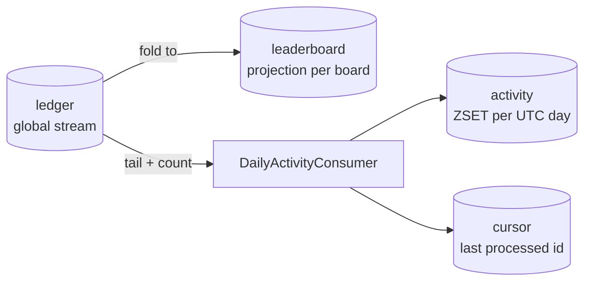
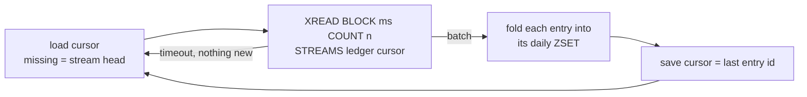

# Architecture

Apex is a leaderboard backend: a Go HTTP service with Redis as the only datastore.

## The core idea: event sourced score

Every score change is recorded as an **event** in an append-only **ledger** (a Redis Stream).
The ledger is the source of truth for the score values. The leaderboards are **projections**:
derived views that can be deleted and rebuilt from the ledger with an identical result.
Each leaderboard is a Redis Sorted Set.

Pros:

- a full audit history of every score (the history API is just a ledger read)
- disposable rankings - projection corruption is repaired by replay
- leaderboards projections (essentially secondary B-tree indexes) allow log times for range operations
- allows future views as new consumers of the same stream, with no
  changes to write operations. We can easily answer all sorts of questions, for example:
    - retrospective records: most active player in July 2025, my personal best of the summer '24
    - biggest single-day swing (biggest comeback)
    - milestones and races: who first crossed 1000 on a board
    - rivalry timeline: every moment A passed B
    - cheater detection: increments per minute per player

## Components

```mermaid
flowchart TD
    Ledger[(Ledger<br/>global stream)]

    Board[Board<br/>slug id, name, status]
    Proj[(Projection<br/>sorted set per board)]
    Player[Player profile<br/>UUID, name]

    Ledger -.->|replay rebuilds| Proj
    Player -->|1:N scores| Proj
    Board -->|1:1| Proj

```

The ledger is the source of truth; every projection is derived from it and can be rebuilt by replay.

### Player profile

Board-independent document (name, creation date) keyed by a
server-generated UUID. Creating a player is profile-only: a player can exist with no scores.

Currently players cannot be deleted, but it's planned.

### Board

Named score containers. Ids are short, client-chosen slugs (`summer-contest2026`)
rather than UUIDs. They are readable and appear in URLs.

The board id is **immutable forever** (ids are written into ledger events),
however, a board has a mutable display name.
A registry (currently acts as a sorting index) keeps the list of boards in creation order.

A board has a status: `active` or `closed`.
A closed board rejects score writes with `409` (reads and ledger replay are unaffected).
In particular, a closed board allows to rebuild the leaderboard projection from the ledger without racing with
concurrent new score writes. Boards can be reopened.

Currently boards cannot be deleted.

### The ledger

One global stream containing all score events.
Event is recorded only if the operation was succesfully applied (fact only).
Currently two event types exist: `set` and `increment` (a delta).
"Set" typed event acts as a snapshot barrier - replay never needs to look past the latest `set`.

Clients can consume the same global order through `GET /api/v1/events`: pass the last seen
event id as an exclusive `after` cursor. In this case, a cursor is managed by client.

### Projection (leaderboard)

The actual leaderboard which faces clients. One sorted set per board holding the current scores.
In app (not API) we call a projection entry a **standing**: besides the score value it holds a player id
and also implicitly implies a "rank", which is its index (1-based). So standing is a (score, player_id, rank).

All standing reads (i.e top-N pages, a single player's standing) are cheap sorted-set operations.
It allows listing operations to use plain limit/offset pagination.

The scores endpoint also accepts `as_of=YYYY-MM-DD`. This reconstructs a transient historical
leaderboard by folding events from the beginning to `as_of`; it does not
consult or modify the live projection.
The current implementation scans the global event history, it **demonstrates time-travel possibilities**
rather than providing a scalable query.

## Mechanics

### Idempotency hash

Some APIs support a `Idempotency-Key` header: the write would store
a fingerprint (derived from the request payload, e.g. `entry_id|op|amount`) under that key with a TTL.
This makes retries idempotent (essential for the incrementing a score or creating a new player).

The same key reused with a different payload (like a score amount) is rejected with `409`.

Board creation doesn;t use this mechanic: `PUT` with a client-chosen slug is already retry-safe.

`Idempotency-Key` is _optional_, but is recommended.

### Request correlation

Every request carries a server-generated id. It is recorded in
score event's `request_id`, returned in the `X-Request-ID` response header and logged.

A client generated `X-Request-ID` header is not supported and **ignored**.

### Score values are bounded integers

`int64` is used.

A client needing a decimal precision might multiply a value on its side.

A client needing a timestamp might also multiply or use a unix timestamp.

A score must stay within **+-1e13** (ten trillion). Both the submitted value and the score
resulting from an increment are bounded, otherwise a request will be rejected.

Why this bound:

- Redis stores leaderboard scores as IEEE-754 doubles, which represent integers exactly only below
2^53 (~e15). Any stored score and any intermediate sum stays under this limit.
- The range admits not only a unix timestamp but also a unix millisecond timestamps (e12). So timestamp-based ranking works out of the box.

Microsecond and nanosecond timestamps won't fit as is.

## The write operations

```mermaid
flowchart LR
    Start([Score write]) --> Dedupe{idempotency \nkey seen?}
	Dedupe -->|yes, same op| Return204([204 - replay])
    Dedupe -->|yes, diff op| Conflict([409])
    Dedupe -->|no| Checks{Validation like \nplayer/board exist}
    Checks -->|no| Reject([4xx])
    Checks -->|yes| Apply[apply to \nprojection] --> Append[append to\n ledger] --> Record[record \nidempotency key] --> Done([204])

    subgraph atomic [one Lua script - all or nothing]
        Dedupe
        Checks
        Apply
        Append
        Record
    end
```

Steps in order: idempotency check → player/board exist & board active → apply to
projection → append event → record idempotency key (if supplied).

All steps run inside a single Lua script: projection and ledger move together or not at all.

Every score write runs one Lua script executing atomically: optional idempotency check → player and
board existence check → apply to the projection → append the event → record the idempotency key
(only when the client supplied one). Projection and ledger move together or not at all.

Rebuild and verification are the operational counterpart. Both are scoped to one board.
Rebuild folds board's ledger events into its projection (a leaderboard). Verification does the same but with a
scratch and then compares it with a live projection.

## Async projections (consumers)

New views don't touch the write path. A view is an another **consumer** of the same global
ledger. Consumer is a goroutine with its own Redis client (its blocking read doesn't compete
with request handlers) and its own durable cursor.

The first implemented consumer is the **daily activity** projection behind `GET /api/v1/activity/daily`. `DailyActivityConsumer` tails the ledger and folds each event into a per-day sorted set (`member = player`,
`score = event count`), with a ~30 day TTL.

```mermaid
flowchart LR
    S[(ledger\nglobal stream)]
    S -->|fold to| LB[(leaderboard\nprojection per board)]
    S -->|tail + count| C[DailyActivityConsumer]
    C --> V[(activity\nZSET per UTC day)]
    C --> Cur[(cursor\nlast processed id)]
```

### Cursor

The cursor is a Redis string, `app:consumer:{name}:cursor`, holding the id of the
last ledger event the consumer processed. The loop reads a batch after that id, applies it, then saves
the new position.

```mermaid
flowchart LR
    Load[load cursor\nmissing = stream head] --> Read[XREAD BLOCK ms COUNT n\nSTREAMS ledger cursor]
    Read -->|timeout, nothing new| Load
    Read -->|batch| Apply[fold each entry into\nits daily ZSET]
    Apply --> Save[save cursor = last entry id]
    Save --> Load
```

On first boot the cursor is absent, so it starts at `0-0` (the stream head) and does a full
catch-up over all history. `XREAD` returns only entries _after_ the given id.

**At-least-once.** The batch is applied _before_ the cursor is saved. If the consumer
crashes between the two, the restart would re-apply the same batch -
so a count can be inflated, but data is never lost. For a proof of concept view it is an
acceptable trade. Also like any projection the view is disposable can can be rebuild (drop the daily ZSETs, reset the cursor to `0-0`).

Note that using the event API `GET /api/v1/events` a client can implement it's own consumer.

## How it got here

The design went through three stages:

1. **Hash + sorted set.** Player profiles are in hashes, scores in a sorted set. Player to score 1 to 1.
    One leaderboard. Inspired by (https://redis.io/solutions/leaderboards/).
2. **Event sourced scores.** The ledger became the source of truth and the sorted set a projection;
   scores gained history and idempotent writes.
3. **Multi-board.** Board became a first-class object. Board to a leaderboard projection 1 to 1.
   Player to scores 1 to N.

## TLDR

### Language

| Term              | Means                                                          | Context                   |
| ----------------- | -------------------------------------------------------------- | ------------------------- |
| **event**         | one applied operation (a fact)                                 | all                       |
| **ledger**        | append-only record of score **events**                         | all                       |
| **tombstone**     | the delete **event**                                           | app, API uses "delete"?   |
| **board**         | named score container with lifecycle.                          | all                       |
| projection        | content of the **board** (derived view of the **ledger**)      | app                       |
| standing          | **projection** read model: (playerId, boardId, value, rank)    | API uses generic "score"? |
| **replay**        | Build a **projection** using the **ledger**                    | app                       |
| idempotency table | idempotency records: what reqIds were applied using **events** | app                       |
| **profile**       | player's info (no score)                                       | all                       |
| **stream entry**  | Redis Stream item (raw **event**)                              | redis                     |
| **consumer**      | background reader that folds the **ledger** into a view        | app                       |
| **cursor**        | last processed **event** id by the **consumer**                | app                       |

Contexts:

- all (codebase, docs, public API)
- app (codebase, docs)
- redis (storage codebase, not domain)

### Rules (invariants)

1. **The event stream is the source of truth for standings.** The leaderboard ZSET (Sorted Set) is a projection:
   it can be deleted and rebuilt from stream, and the result must be the same.

2. **Events record facts only.** An event exists iff the operation was applied.
   E.g failed score increment is not appended.

3. **A non idempotent write carries a client `request_id` (Idempotency-key).**
   Retrying the same request_id produces the same result.

4. **`set` is a snapshot barrier.** The current score of a player is:
   `last set value + sum of increments after it`. Replay never needs to look
   past the most recent `set`.

---
---

## API notes (raw)

### Increment endpoint (`POST scores/{id}/increment`) and Idempotency key

Problem: `increment` applies a delta (`+amount`) which is not idempotent.
If a client retries, we'll end up with a wrong, doubled value. **This makes it barely usable**.
Fix: making endpount actually idempotent via a unique key.

The client attaches a unique token. The server applies the increment and marks a token as "served" (with some TTL). A later request won't apply the operation.

Using the header is a known implementation, we do the same.

- https://docs.stripe.com/api/idempotent_requests
- https://developer.mozilla.org/en-US/docs/Web/HTTP/Reference/Headers/Idempotency-Key

Lua script is used to ensure that an operation is atomic.

_Note: alternative is to remove `/increment` and use set. But that introduces the worse get + set race condition, see info below._

### Set endpoint (`PUT /api/v1/boards/{board_id}/scores/{player_id}`)

Potential problem: read-modify-write, a client does `GET` → computes a new value → `PUT`.
Two clients might read the same value and then set different values, one of them will be lost.

This depends on a client scenario and covers the usage of the **two endpoints together**.
_Do we need this for a leaderboard?_ Scores are volatile, and usually are incremented (and if the absolute value is set, it does not depend on the previous value). Also if a race occurs, last-write-wins may be fine.

#### Solution to consider: OCC

GET returns a version alongside the value, and have the client send it back on PUT.
The server applies the write only if the version still matches.

Implementation notes:

- Where to store and how to maintain the version in redis
- Lua script will be needed
- https://developer.mozilla.org/en-US/docs/Web/HTTP/Reference/Headers/ETag
- https://developer.mozilla.org/en-US/docs/Web/HTTP/Reference/Headers/If-Match

### Listing endpoint (`GET /api/v1/boards/{board_id}/scores`) and pagination

The leaderboard is a ZSET which naturally is good for any kind of ranges and hence the pagination. Arguably most important leaderboard functionality - Top N - is just the pagination with starting with the first page.

Two important pagination properties:

- **Performance** — not an issue for us. Sorted set performs ranges in log time
(In SQL or mongo offset is not cheap and usually cursor is used)
- **Consistency** — under concurrent writes items shift between page reads,
so some items can be skipped or duplicated.

#### Approaches

**Offset / limit** — `?limit=10&offset=0`

Pros: simplest, no state, the native ZSET operation.

Cons: weakest consistency.

**Cursor relies on player_id** — cursor = the last row's `(score, player_id)`.

Next page: `rank = ZREVRANK(leaderboard, player_id)`, then `ZREVRANGE rank+1 rank+size`.

Pros:

- also simple, while lua scripting is probably required
- more robust than offset — unaffected by changes far above the cursor.
  misses. (The `score` half is only a staleness check, or a fallback if delete ever returns.)

Cons:

We rely on the score. If the anchor's score moves,
even an _unchanged_ row can be skipped or duplicated.

Illustration with page size 2, and elements `A=100 B=90 C=80 D=70`:

- page 1 returns `A, B`, cursor = `B`.
- `B` drops 90 → 75 => new order `A, C, B, D`
- page 2 reads `D`
- => `C` is skipped and never was returned

**Value cursor (composite score)** — cursor = the last row's score value.

Next page op will look something like `ZRANGE key (S_last -inf REV BYSCORE LIMIT 0 size`.

- The `(` bound is exclusive, so scores must be **unique**.
- Solution: bake a tiebreaker into the score (e.g. `points·BIG + seq`, or an inverse
  timestamp in the fraction), so no two members collide.
  UPD: scores are now integers a fractional tiebreaker doesnt fit.
  UPD: scores are also capped at `1e13`, so `points·BIG + seq` has to fit that budget too -
  the composite would have to shrink the usable points range.

Pros: the "correct" cursor — anchors on a _fixed value_ in the total order, so every
  _stationary_ row is returned exactly once.
  
Cons:

- Complex implementation: changes how score are stored (more code, less transparent db etc)
- without unique scores the exclusive bound `(` skips tied members

#### Decision

Currenly using the simplest one. The second approach is a bit weird,
and the third one is complex and the pay off is unclear.
